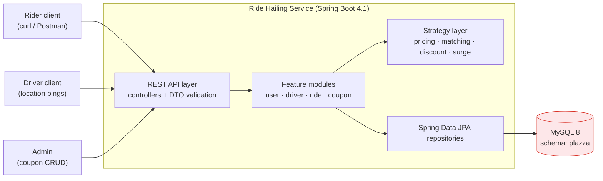
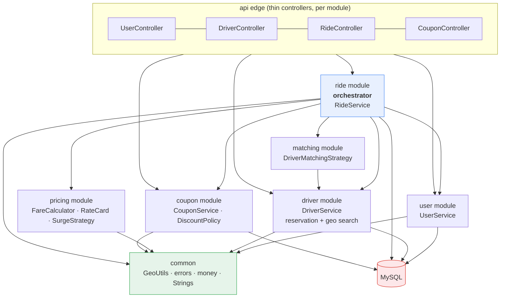
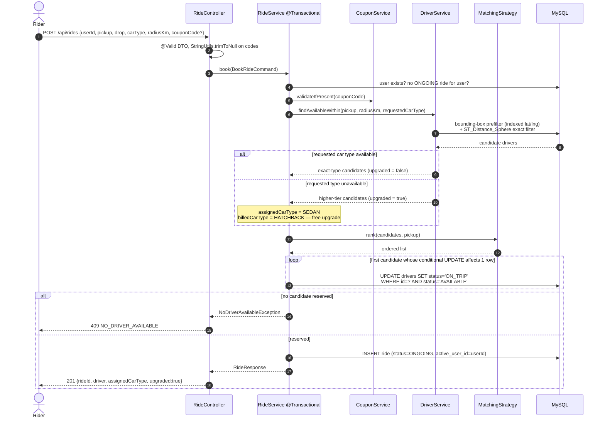
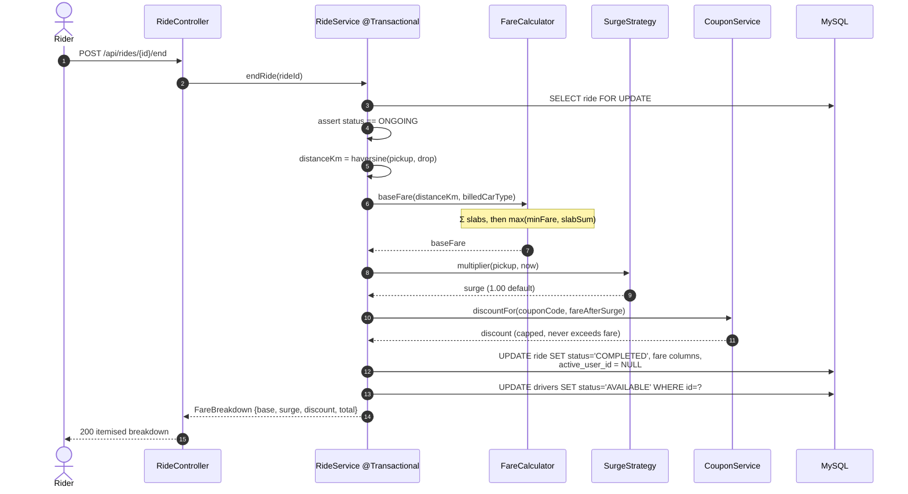
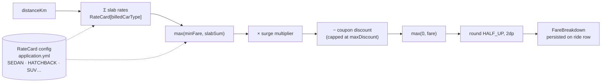
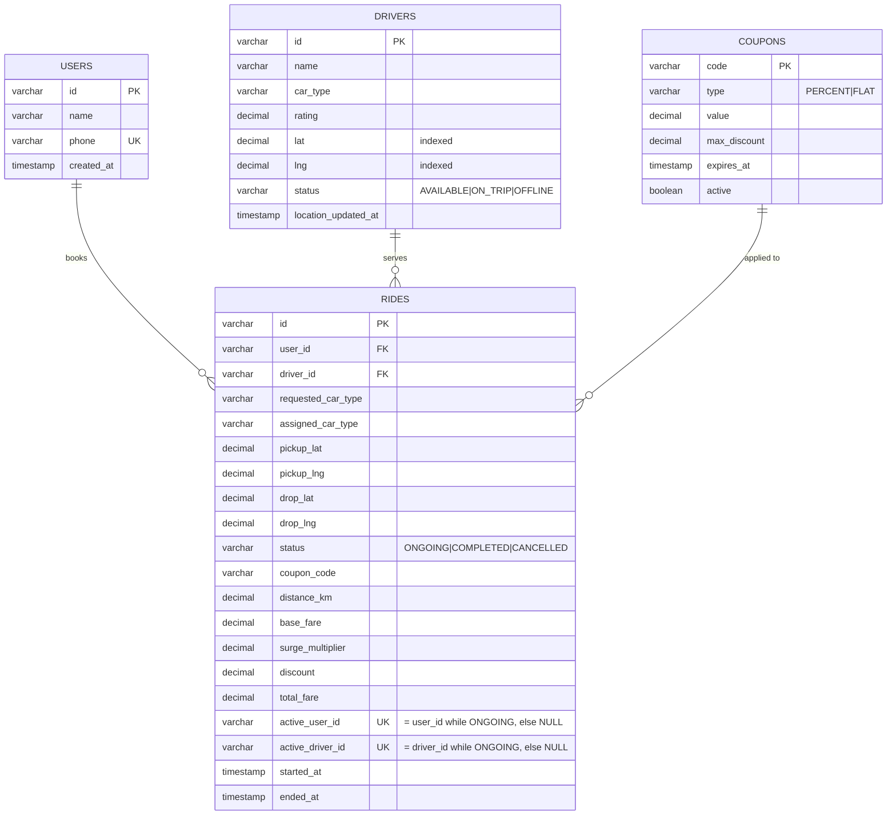
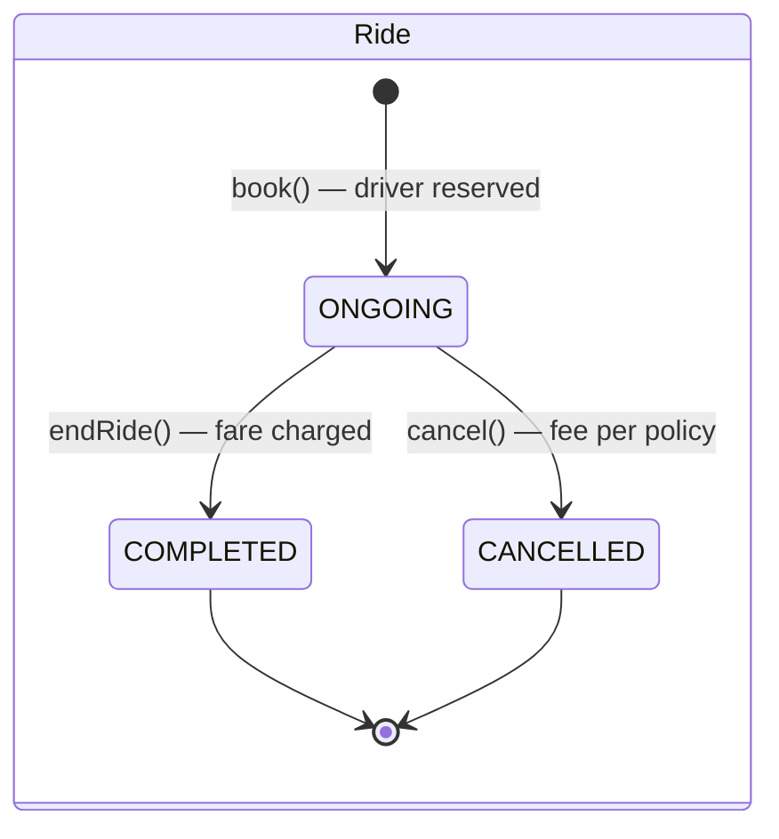
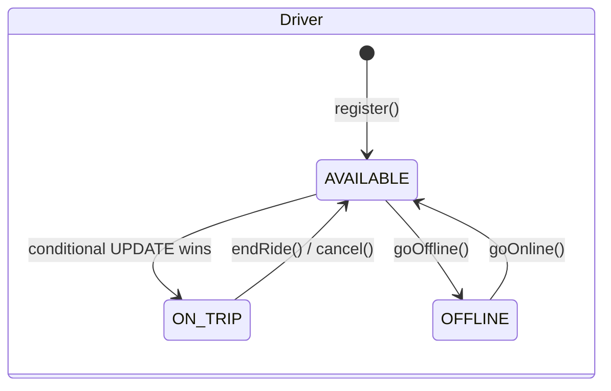

# High Level Design — Ride Hailing Backend

## 1. System context

Single Spring Boot service, REST over HTTP, **MySQL 8 for persistence**. State lives in the database, not in process memory, so the concurrency and uniqueness guarantees are enforced by the storage engine rather than by hopeful service code.

---

## 2. Modular structure

Package **by feature**, not by layer. Each module owns its entities, repositories, and services, and publishes exactly one service interface. Internals sit under `<module>/internal/` and are never imported across a boundary.

**Dependency rules**

1. Arrows point one way. No module imports the `ride` module.
2. `common` depends on nothing; everything may depend on `common`.
3. Cross-module calls carry DTOs / value objects, never managed JPA entities.
4. `ride` orchestrates and contains no arithmetic — every number it returns came from `pricing`, `matching`, or `coupon`.

Why it matters for the demo: the live extension exercise ("add an SUV", "add a tier", "add a coupon type") lands inside exactly one module or in configuration, and nothing above it recompiles.

---

## 3. Core flow — book a ride

`rank(...)` returns an **ordered list**, not a single winner. A lost reservation race therefore falls through to the next driver instead of failing the booking.

---

## 4. Core flow — end a ride and price it

Both DB writes sit in one transaction: a ride never completes while its driver stays stuck `ON_TRIP`.

Returning an itemised **`FareBreakdown`** instead of a bare number is deliberate — it makes the pricing demo-able and the tests precise about which stage broke.

---

## 5. Fare pipeline

Adding SUV = one config block. Adding a tier = one config row. No code path changes.

---

## 6. Data model

**The `active_user_id` / `active_driver_id` trick:** MySQL unique indexes ignore `NULL`s. Setting these columns to the id while a ride is `ONGOING` and to `NULL` on completion makes "one active ride per user, one per driver" a **database invariant**, not a service-layer hope. Two concurrent bookings for the same rider cannot both survive commit.

All money columns are `DECIMAL(10,2)`; all coordinates `DECIMAL(9,6)`.

---

## 7. State machines

Driver status changes only through a **conditional UPDATE with a status predicate** — never `SELECT` then `save()`. That single rule removes double-booking without a global lock.

---

## 8. API surface

| Method | Path | Purpose |
|---|---|---|
| `POST` | `/api/users` | Register a user |
| `POST` | `/api/drivers` | Register a driver (name, carType, location, rating) |
| `PATCH` | `/api/drivers/{id}/location` | Update cab location |
| `PATCH` | `/api/drivers/{id}/status` | Go online / offline |
| `POST` | `/api/rides` | Book a ride |
| `POST` | `/api/rides/{id}/end` | End ride → `FareBreakdown` |
| `POST` | `/api/rides/{id}/cancel` | Cancel ride (bonus) |
| `GET` | `/api/users/{id}/rides?status=ONGOING\|COMPLETED` | Rider history |
| `GET` | `/api/drivers/{id}/rides?status=…` | Driver history |
| `POST` | `/api/coupons` | Add coupon |
| `DELETE` | `/api/coupons/{code}` | Delete coupon |
| `GET` | `/api/fare/estimate` | Quote without booking (nice-to-have) |

**Error contract:** domain exceptions map through `GlobalExceptionHandler` to `{code, message}` — `NO_DRIVER_AVAILABLE` → 409, `INVALID_COUPON` → 400, `RIDE_NOT_FOUND` → 404, `ILLEGAL_RIDE_STATE` → 409, `DUPLICATE_ACTIVE_RIDE` → 409, validation failure → 400 with field errors.

---

## 9. Key trade-offs

| Decision | Chosen | Rejected | Why |
|---|---|---|---|
| Storage | **MySQL 8 + Spring Data JPA** | In-memory maps (spec permits) | A real DB makes the hard guarantees — atomic reservation, unique active ride — enforceable and demonstrable instead of asserted. |
| Schema management | Hibernate `ddl-auto=update` for the exercise | Flyway migrations | Flyway is correct for production and is named in "what I'd do with more time"; writing migrations inside a 2-hour budget buys nothing for the grade. |
| Concurrency | Conditional `UPDATE … WHERE status='AVAILABLE'` (DB-level CAS) | `synchronized`, or `SELECT` + `save()`, or `@Version` retry | Single round trip, no lock held across the match, correct across multiple app instances. Optimistic-lock retry solves the same problem with more code and more failure modes. |
| Rider double-booking | Nullable unique column (`active_user_id`) | Service-level "check then insert" | Check-then-insert is a race. The unique index is the only thing that actually holds under load. |
| Driver geo search | Bounding-box prefilter on indexed `lat`/`lng`, then `ST_Distance_Sphere` | Full scan + Java haversine; or geohash / spatial index | Index-assisted and readable. `POINT` + `SPATIAL INDEX` is the documented scale answer, contained in one repository method. |
| Module shape | Package-by-feature in one Maven module, boundaries by convention | Multi-module Maven reactor | Same boundary discipline, none of the reactor setup cost. Promotion to real modules is mechanical. |
| Money | `BigDecimal` + `DECIMAL(10,2)`, HALF_UP | `double` / `FLOAT` | Floating-point money in a pricing round is an automatic finding. |
| Upgrade billing | Bill `requestedCarType`, assign `assignedCarType` | Bill assigned type then discount back | Two explicit columns make "free upgrade" a data fact, testable in one assertion, with no compensating arithmetic. |
| Strategy selection | Spring `Map<String, Strategy>` + property | `if/else` inside `RideService` | Swapping nearest ↔ highest-rated must not touch booking logic — stated bonus requirement. |
| Strings | `StringUtils` (commons-lang3) everywhere | Hand-rolled null/blank/case checks | One consistent null-safe idiom; no `NullPointerException` surface in coupon-code and phone handling. |
| Distance | Haversine, pickup → drop | Routed road distance | No routing service available offline; `DistanceCalculator` is the seam for the real one. |

---

## 10. What this design does not do (and would, with more time)

- **No Flyway migrations** — schema comes from `ddl-auto=update`; production needs versioned migrations and `ddl-auto=validate`.
- **No idempotency keys** — a retried `POST /api/rides` can create a second ride once the first completes.
- **Geo search is bounding-box + trig**, not a spatial index or geohash bucket; fine at demo scale, replaced inside one repository method.
- **Surge ships as `NoSurgeStrategy` plus one demand/supply implementation**; a real one needs a rolling demand window per geo cell and a cap.
- **No outbox / event log** — a real system emits ride lifecycle events for fare audit and analytics.
- **No auth, no rate limiting, no pagination** on history endpoints.
- **Read scaling untouched** — history queries hit the primary; real deployments read from a replica.
