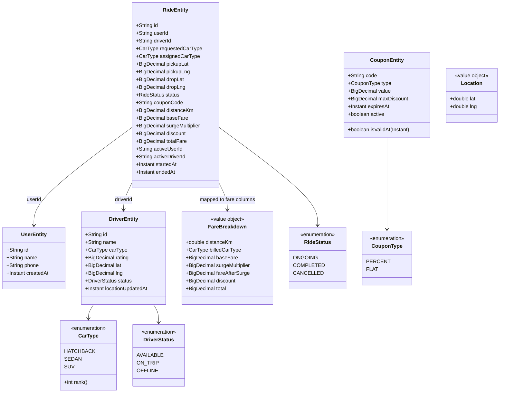
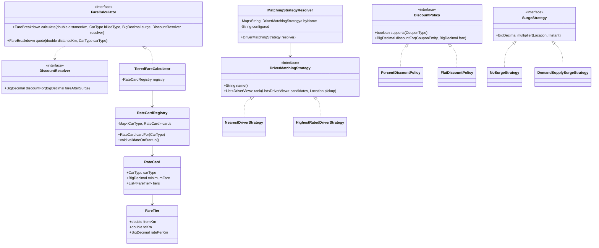
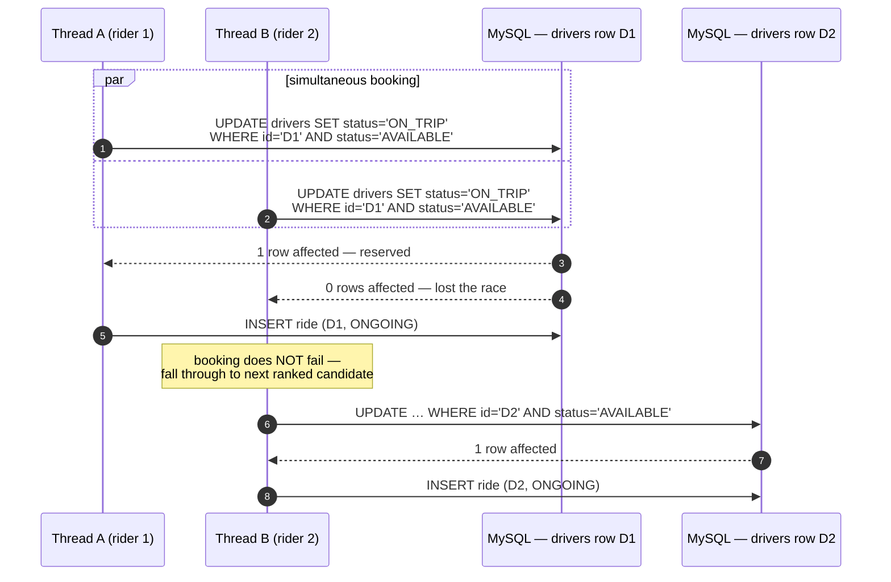

# Low Level Design — Ride Hailing Backend

Companion to [HLD.md](./HLD.md). This is the implementation contract: modules, types, SQL, algorithms, and the tests that prove them.

**Stack:** Java 17 · Spring Boot 4.1.0 · Spring Data JPA (Hibernate 7.4) · MySQL 8 (`mysql-connector-j` 9.7) · Apache Commons Lang3 3.17 · Lombok · JUnit 5.

---

## 1. Modular package layout

Package **by feature**. Every module publishes one service interface in its root package; everything else lives in `internal/` and is off-limits to other modules.

```
org.plazza.plazza
├── PlazzaApplication.java
│
├── common/                                  ← depends on nothing
│   ├── geo/          Location (value object), GeoUtils, DistanceCalculator
│   ├── money/        Money (BigDecimal helpers, HALF_UP scale 2)
│   ├── text/         Texts (thin wrapper over StringUtils: normalizeCode, requireNonBlank)
│   ├── error/        ApiError, GlobalExceptionHandler, DomainException hierarchy
│   └── enums/        CarType
│
├── user/
│   ├── UserService.java          (public API of the module)
│   ├── UserView.java             (cross-module DTO)
│   ├── api/          UserController, dto/RegisterUserRequest, dto/UserResponse
│   └── internal/     UserEntity, UserJpaRepository, UserServiceImpl
│
├── driver/
│   ├── DriverService.java        ← registration, location, reservation, geo search
│   ├── DriverView.java
│   ├── api/          DriverController, dto/*
│   └── internal/     DriverEntity, DriverJpaRepository, DriverServiceImpl
│
├── matching/
│   ├── DriverMatchingStrategy.java
│   ├── MatchingStrategyResolver.java
│   └── internal/     NearestDriverStrategy, HighestRatedDriverStrategy
│
├── pricing/
│   ├── FareCalculator.java
│   ├── FareBreakdown.java
│   ├── RateCardProperties.java   (@ConfigurationProperties "pricing")
│   ├── surge/        SurgeStrategy, internal/NoSurgeStrategy, internal/DemandSupplySurgeStrategy
│   └── internal/     TieredFareCalculator, RateCard, FareTier, RateCardRegistry
│
├── coupon/
│   ├── CouponService.java
│   ├── api/          CouponController, dto/*
│   └── internal/     CouponEntity, CouponJpaRepository, CouponServiceImpl,
│                     policy/DiscountPolicy, policy/PercentDiscountPolicy, policy/FlatDiscountPolicy
│
└── ride/                                    ← the orchestrator; owns no arithmetic
    ├── RideService.java
    ├── api/          RideController, dto/BookRideRequest, dto/RideResponse, dto/FareResponse
    └── internal/     RideEntity, RideJpaRepository, RideServiceImpl, CancellationPolicy
```

**Enforced rules**

| Rule | Consequence |
|---|---|
| `*/internal/**` is never imported across module boundaries | entities cannot leak; refactoring inside a module is free |
| Cross-module payloads are views/DTOs (`DriverView`, `UserView`) | `RideService` never holds a managed `DriverEntity` |
| Nothing imports `ride` | dependency graph stays acyclic |
| `common` imports nothing from features | no cycles through utilities |

---

## 2. Domain / persistence class diagram



`activeUserId` / `activeDriverId` are not business data — they exist purely to carry the DB uniqueness invariant (§5.2). They hold the id while `ONGOING` and `NULL` otherwise.

---

## 3. Strategy contracts



**Two signatures carry the design:**

1. `rank(...)` returns an ordered `List<DriverView>`, not `Optional<DriverView>`. That is what lets the booking loop retry after a lost reservation race without the matching strategy knowing that concurrency exists.
2. `calculate(...)` takes a **`DiscountResolver` callback**, not a pre-computed discount amount. The pricing module owns the *ordering* rule — a coupon applies to the fare **after** surge — while the coupon module owns the discount arithmetic. A caller therefore cannot apply a coupon at the wrong stage, and `RideService` stays free of fare logic. `TieredFareCalculator` also clamps whatever the resolver returns into `[0, fareAfterSurge]`, so one badly written policy cannot produce a refund.

---

## 4. Configuration

```yaml
spring:
  application.name: plazza
  datasource:
    url: jdbc:mysql://localhost:3306/plazza?createDatabaseIfNotExist=true&serverTimezone=UTC
    username: root
    password: ${MYSQL_PASSWORD:root}
  jpa:
    hibernate.ddl-auto: update          # exercise only; Flyway + validate in production
    open-in-view: false                 # no lazy loading in controllers
    properties.hibernate.dialect: org.hibernate.dialect.MySQLDialect

pricing:
  cards:
    HATCHBACK:
      minimumFare: 40
      tiers:
        - { fromKm: 0, toKm: 2,      ratePerKm: 8 }
        - { fromKm: 2, toKm: 5,      ratePerKm: 6 }
        - { fromKm: 5, toKm: 100000, ratePerKm: 4 }
    SEDAN:
      minimumFare: 50
      tiers:
        - { fromKm: 0, toKm: 2,      ratePerKm: 10 }
        - { fromKm: 2, toKm: 5,      ratePerKm: 8 }
        - { fromKm: 5, toKm: 100000, ratePerKm: 5 }

matching:
  strategy: nearest            # or: highestRated
booking:
  defaultRadiusKm: 5
cancellation:
  flatFee: 25
```

Tiers are half-open `[fromKm, toKm)`, contiguous and ascending. `RateCardRegistry.validateOnStartup()` asserts that on boot, so a malformed card **fails fast instead of silently mispricing**.

Adding SUV during the live extension = one enum constant + one yaml block.

---

## 5. SQL that matters

### 5.1 Reservation — the concurrency primitive

```java
// DriverJpaRepository
@Modifying
@Query("""
        UPDATE DriverEntity d
           SET d.status = 'ON_TRIP'
         WHERE d.id = :id
           AND d.status = 'AVAILABLE'
        """)
int tryReserve(@Param("id") String id);      // returns 1 = won, 0 = lost

@Modifying
@Query("""
        UPDATE DriverEntity d
           SET d.status = 'AVAILABLE'
         WHERE d.id = :id
           AND d.status = 'ON_TRIP'
        """)
int release(@Param("id") String id);
```

One statement, one round trip, atomic under MySQL row locking, correct even across multiple app instances. No `SELECT` then `save()` anywhere in the driver status path — that is the invariant to defend in Q&A.

### 5.2 Uniqueness invariants

```java
@Entity
@Table(name = "rides",
       uniqueConstraints = {
           @UniqueConstraint(name = "uk_active_user",   columnNames = "active_user_id"),
           @UniqueConstraint(name = "uk_active_driver", columnNames = "active_driver_id")
       },
       indexes = {
           @Index(name = "ix_rides_user",   columnList = "user_id"),
           @Index(name = "ix_rides_driver", columnList = "driver_id")
       })
```

MySQL unique indexes ignore `NULL`s, so setting `active_user_id = userId` while `ONGOING` and `NULL` on completion turns "one active ride per rider" into a constraint the database enforces. Two parallel bookings for the same rider cannot both commit — the loser surfaces as `DUPLICATE_ACTIVE_RIDE` (409), not as corrupt data.

### 5.3 Geo search — bounding box, then exact

```java
@Query(value = """
        SELECT * FROM drivers d
         WHERE d.status = 'AVAILABLE'
           AND d.lat BETWEEN :minLat AND :maxLat
           AND d.lng BETWEEN :minLng AND :maxLng
           AND ST_Distance_Sphere(POINT(d.lng, d.lat), POINT(:lng, :lat)) <= :radiusMeters
        """, nativeQuery = true)
List<DriverEntity> findAvailableWithin(...);
```

The `BETWEEN` clauses are index-assisted and cheap; `ST_Distance_Sphere` runs only on the survivors. Bounding box derived as `±radiusKm / 111.0` degrees latitude, longitude widened by `/ cos(lat)`.

---

## 6. Concurrency: two riders, one driver



```java
// RideServiceImpl.book — the whole retry story
for (DriverView candidate : strategy.rank(candidates, pickup)) {
    if (driverService.tryReserve(candidate.id())) {
        return createRide(user, candidate, command);
    }
}
throw new NoDriverAvailableException(radiusKm);
```

Three layers of defence, each doing one job:

| Race | Guard |
|---|---|
| Two riders, same driver | conditional `UPDATE` predicate on `status` |
| One rider, two parallel requests | `uk_active_user` unique index |
| Ride ended twice | `SELECT … FOR UPDATE` on the ride + `status == ONGOING` assertion inside the transaction |

---

## 7. Repository and service contracts

```java
public interface DriverService {                       // driver module public API
    DriverView register(RegisterDriverCommand cmd);
    void updateLocation(String driverId, Location location);
    void updateStatus(String driverId, DriverStatus status);
    List<DriverView> findAvailableWithin(Location pickup, double radiusKm, CarType requestedType);
    List<DriverView> findUpgradeCandidates(Location pickup, double radiusKm, CarType requestedType);
    boolean tryReserve(String driverId);
    void release(String driverId);
}

public interface RideService {                         // ride module public API
    RideView book(BookRideCommand cmd);
    FareBreakdown endRide(String rideId);
    RideView cancel(String rideId);
    List<RideView> historyForUser(String userId, RideStatus statusOrNull);
    List<RideView> historyForDriver(String driverId, RideStatus statusOrNull);
}

public interface CouponService {                       // coupon module public API
    CouponView add(CreateCouponCommand cmd);
    void delete(String code);
    void validate(String code);                        // throws InvalidCouponException
    BigDecimal discountFor(String code, BigDecimal fare);
}
```

| Service | Owns | Does not own |
|---|---|---|
| `UserService` | Registration, existence checks | Anything ride-related |
| `DriverService` | Registration, location, status, geo search, atomic reservation | Deciding *which* driver (that is `matching`) |
| `RideService` | Booking, ending, cancelling, history, transaction boundaries | Fare arithmetic, ranking, discount maths |
| `CouponService` | CRUD, validity, dispatch to the right `DiscountPolicy` | *When* a coupon applies (that is `RideService`) |

---

## 8. Algorithms

### 8.1 Tiered base fare

```
baseFare(distanceKm, card):
    slabSum = 0
    for tier in card.tiers:                       # ascending, contiguous, half-open
        billable = max(0, min(distanceKm, tier.toKm) - tier.fromKm)
        slabSum += billable * tier.ratePerKm
    return max(card.minimumFare, slabSum)
```

Worked check — SEDAN 7 km: `2×10 + 3×8 + 2×5 = 54`; `max(50, 54) = ₹54`.
SEDAN 3 km: `2×10 + 1×8 = 28`; `max(50, 28) = ₹50` — minimum fare wins.

### 8.2 Full pipeline

```
fareAfterSurge = baseFare × surgeMultiplier
discount       = policy.discountFor(coupon, fareAfterSurge)      # capped at maxDiscount
total          = max(0, fareAfterSurge − discount).setScale(2, HALF_UP)
```

Every intermediate value is kept on `FareBreakdown` and persisted on the ride row, so a failing test names the exact stage that broke and the demo can show the arithmetic.

### 8.3 Candidate search + free upgrade

```
book(pickup, radiusKm, requestedType):
    exact = driverService.findAvailableWithin(pickup, radiusKm, requestedType)
    if exact not empty:
        candidates = exact;    upgraded = false;   billedType = requestedType
    else:
        upgrades = driverService.findUpgradeCandidates(...)   # carType.rank > requested.rank
        if upgrades empty: throw NoDriverAvailableException
        candidates = upgrades; upgraded = true;    billedType = requestedType   # free upgrade
```

Billing always uses `requestedCarType`; assignment records the driver's actual `carType`. The free upgrade therefore costs **zero arithmetic** — it is two columns on the ride row.

### 8.4 Haversine (`common.geo.GeoUtils`)

```
distanceKm(a, b):
    R = 6371.0
    dLat = toRadians(b.lat - a.lat);  dLng = toRadians(b.lng - a.lng)
    h = sin²(dLat/2) + cos(toRadians(a.lat))·cos(toRadians(b.lat))·sin²(dLng/2)
    return 2R · asin(min(1, sqrt(h)))
```

Used for fare distance in Java; MySQL's `ST_Distance_Sphere` does the equivalent filtering inside the geo query. Both are checked against the same fixture in `GeoUtilsTest`.

---

## 9. String handling — commons-lang3

Single idiom across the codebase; no hand-rolled null/blank/case checks anywhere.

```java
// common/text/Texts.java — the only place StringUtils is wrapped
public final class Texts {

    public static String normalizeCode(String raw) {          // coupon codes, car type params
        return StringUtils.upperCase(StringUtils.trimToNull(raw));
    }

    public static String requireNonBlank(String value, String field) {
        if (StringUtils.isBlank(value)) {
            throw new ValidationException(field + " must not be blank");
        }
        return StringUtils.trim(value);
    }

    public static boolean equalsIgnoreCaseSafe(String a, String b) {
        return StringUtils.equalsIgnoreCase(a, b);
    }
}
```

| Situation | Use |
|---|---|
| Blank / null check | `StringUtils.isBlank` / `isNotBlank` |
| Optional inbound field | `StringUtils.trimToNull` |
| Coupon code normalisation | `Texts.normalizeCode` — stored and looked up upper-cased and trimmed |
| Null-safe comparison | `StringUtils.equalsIgnoreCase` |
| Defaulting | `StringUtils.defaultIfBlank` |

Coupon codes normalise on both write and read, so `" save20 "` and `SAVE20` are the same coupon.

---

## 10. Test matrix

**Unit — no Spring, no database** (the graded core; runs in milliseconds):

| Class | Test | Assertion |
|---|---|---|
| `TieredFareCalculatorTest` (26 tests) | `sedan7km` | ₹54 (2×10 + 3×8 + 2×5) |
| | `shortRideHitsTheFloor` | 3 km slabs give ₹28 → floored to ₹50 |
| | `boundariesAreHalfOpen` | 2 km = ₹20, 5 km = ₹44 on a **zero-minimum card**, so the floor cannot hide a double-counted boundary |
| | `fourKmUsesTwoSlabs` | ₹36 without a floor, ₹50 with one |
| | `longRideUsesFinalTier` | 100 km = ₹519 |
| | `hatchbackIsCheaper` | ₹42 < ₹54 for the same trip |
| | `perCarTypeMinimum` | ₹40 hatchback vs ₹50 sedan |
| | `zeroDistance` | ₹50 |
| | `surgeAppliesAfterTheFloor` | 1.5 × ₹50 = ₹75, not `max(50, 28×1.5)` |
| | `discountAppliesAfterSurge` | 10% of the ₹108 post-surge fare = ₹10.80, not ₹5.40 |
| | `discountCannotExceedTheFare` | ₹500 discount on ₹54 → total ₹0 |
| | `negativeDiscountIsIgnored` | a misbehaving policy cannot inflate a fare |
| | `unconfiguredCarTypeIsRejected` | SUV without a card throws, never guesses a price |
| | `amountsAreScaledForStorage` | every amount at scale 2 |
| | `negativeDistanceRejected` / `nonPositiveSurgeRejected` | input guards |
| `RateCardRegistryTest` (12 tests) | `gapIsRejected` / `overlapIsRejected` | malformed card fails at startup, naming the car type |
| | `mustStartAtZero`, `emptySlabIsRejected`, `negativeRateIsRejected` | card validation |
| | `outOfOrderTiersAreSorted` | config order is not a trap |
| | `addingACarTypeIsConfigurationOnly` | SUV card priced with zero code change |
| `DiscountPolicyTest` (14 tests) | `capped` | 20% of ₹500 capped at ₹50 |
| | `capIsACeilingNotAFloor` | 20% of ₹54 stays ₹10.80 |
| | `neverExceedsTheFare` | ₹100 flat on ₹54 → discount ₹54 |
| | `expiryIsExclusive` | dead at the instant it expires |
| | `deactivated` | reports *why* it is unusable |
| `GeoUtilsTest` (7 tests) | `boundingBoxCoversTheRadius` | the indexed prefilter can never drop a driver the exact filter would accept |
| `MatchingStrategyTest` | `nearestPicksClosestFirst` / `highestRatedPicksBestFirst` | ordering per strategy |
| `RideServiceTest` (mocked ports) | `hatchbackRequest_sedanAssigned_billedHatchback` | `assignedCarType=SEDAN`, `billedCarType=HATCHBACK` |
| | `noDriverInRadius` | `NoDriverAvailableException` |
| | `lostReservationRace_fallsToNextCandidate` | `tryReserve` false then true → ride created |
| | `endRide_onCompletedRide_rejected` | `IllegalRideStateException` |
| `GeoUtilsTest` | `knownCoordinates_matchExpectedKm` | haversine sanity |

**Integration — real MySQL, schema `plazza_test`:**

| Class | Test | Assertion |
|---|---|---|
| `DriverJpaRepositoryIT` | `tryReserve_secondCallReturnsZero` | conditional UPDATE semantics |
| | `findAvailableWithin_excludesOutsideRadius` | geo query correctness |
| `RideConcurrencyIT` | `twoRiders_oneDriver_exactlyOneWins` | `CountDownLatch`, 2 threads → 1 ride + 1 `NoDriverAvailable` |
| | `sameUser_twoParallelBookings_uniqueConstraintFires` | `DUPLICATE_ACTIVE_RIDE` |
| `RideFlowIT` | `book_then_end_happyPath` | 201 then 200 with itemised breakdown; driver back to `AVAILABLE` |

No H2 stand-in: the geo query is MySQL-specific, and an H2 dialect that silently accepts different SQL would be a false green.

---

## 11. Live-extension cheat sheet

| Interviewer asks | Change | Files touched |
|---|---|---|
| "Add an SUV car type" | Enum constant + rate-card block | `CarType`, `application.yml` |
| "Add a new pricing tier" | One `tiers` row | `application.yml` |
| "Add a flat-discount coupon" | Already built (`FlatDiscountPolicy`); a new kind = one class + `supports()` | `coupon/internal/policy/` |
| "Switch to highest-rated matching" | `matching.strategy: highestRated` | `application.yml` |
| "Charge a cancellation fee after 5 minutes" | New `CancellationPolicy` implementation | `ride/internal/` |
| "Bill the upgraded car at its own rate" | Pass `assignedCarType` instead of `requestedCarType` to `FareCalculator` | one line in `RideServiceImpl` |
| "Make surge real" | Implement `DemandSupplySurgeStrategy`, flip the bean | `pricing/surge/internal/` |
